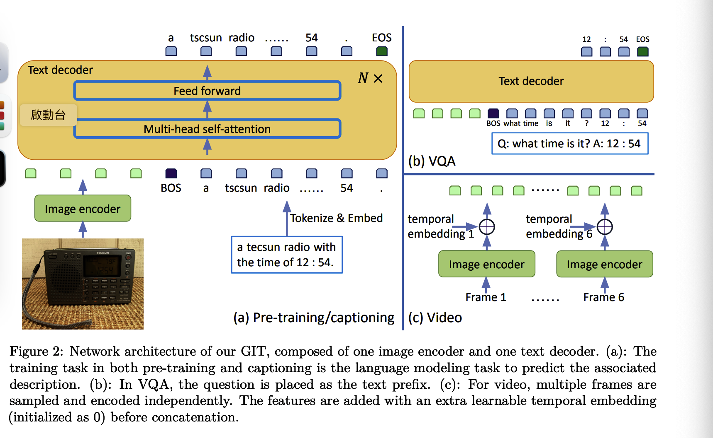
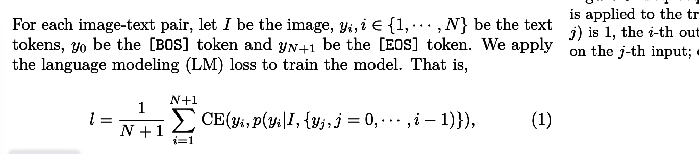

# GIT: A Generative Image-to-text Transformer for Vision and Language

> https://arxiv.org/pdf/2205.14100v5.pdf

## Abstract

Generative Image-to-text Transformer,GIT 為了統一視覺語言任務，例如圖像/視頻字幕和問題回答。

在GIT中，將之前繁瑣的解碼器-編碼器結構變成**圖片編碼器和文字解碼器**

## Introduction

之前Vision-language(VL)模型的有

CLIP，Florence，SimVLM

> 自己的翻譯

預訓練任務是那，把一張輸入圖片整個影射到文字描述，在language modeling objective

> google翻譯

預訓練任務只是將輸入圖像映射到具有語言建模目標的整個相關文本描述

**圖像編碼器**是一個類似 Swin 的視覺轉換器，基於對比任務對大量圖像-文本對進行預訓練，這消除了對物體檢測器的依賴。

**文本解碼器**是一個用於預測相關文本的轉換器網絡。

**整個網絡**都經過語言建模任務的訓練。 對於VQA，輸入問題被視為文本前綴，答案以自回歸的方式生成。

## Related Work

在VL預訓練中，多任務預訓練被廣泛使用，為網絡賦予多種或增強的能力。

。。。

介紹了一堆方法

。。。

在這些方法中，在解碼輸出之前利用多模態變換器編碼器合併文本輸入。

## Generative Image-to-text Transformer

### Network Architecture

**Image encoder** 

輸入：圖像

輸出：（compact 2d feature map）緊湊的二維特徵圖，會被拉直變成特徵列表

通過額外的<u>線性層和層規範層</u>，圖像特徵被投影到 D 維度，即輸入
到文本解碼器。

文本解碼器是一個用於預測文本描述的轉換器模塊。 Transformer 模塊由多個 Transformer 塊組成，每個 Transformer 塊由一個自註意力層和一個前饋層組成。
文本被標記化並嵌入到 D 維度中，然後添加位置編碼和層規範層。

圖像特徵和文本嵌入一起作為transformer的輸入。

文本以 [BOS] 令牌開始，並以自回歸方式解碼，直到 [EOS] 令牌或達到最大步數。

隨機初始化文本編碼器，

### Pre-training

使用語言建模模型損失作為訓練損失

where CE is the cross-entropy loss with label smoothing of 0.1.

### Fine-tuning

我們還將生成模型應用於圖像分類任務，其中類名稱被解釋為
圖像標題，並且我們的 GIT 經過微調，可以以自回歸的方式預測結果。 這是不同的
現有的工作通常預先定義詞彙表並使用線性層（帶有 softmax）
預測每個類別的可能性。 當新數據和新數據出現時，這種基於新一代的方案是有益的

--------

## Setting

一個具有挑戰性的問題是根據總數據大小（0.8B 為 39TB）有效地實現數據加載器
圖片）遠大於本地磁盤大小（約 7TB）。 由於數據存儲在 Azure 存儲中，我們將數據下載到本地磁盤後再讀取，而不是直接從雲端讀取。 考慮到未來數據規模可能會變得更大，我們應該確保每個操作獨立於數據數據集大小。 同時，數據下載應與GPU計算重疊，例如需要時數據始終在本地可用。 解決方案概述如下。

1. 圖文對平均分配給C個計算節點。 每個節點只訪問對應的部分。

2. 各節點逐條消耗數據主幹。 每個主幹由 220 個圖像文本對組成，最後一個主幹可能少於 220 個數據。
3. 每個trunk中的數據被隨機打亂。 我們對主幹級別的數據進行混洗，使得成本與數據集大小無關，因此它可以應用於更大的數據集。
4. 混洗後的主幹數據在節點內的 GPU 之間均勻分配。
5. 在每個節點上創建一個額外進程（由本地rank = 0啟動）以預取最多7個未來
樹幹。 由於每個主幹都是為一個節點中的所有Rank設計的，因此其他Rank不需要啟動預取過程，從而避免了競爭條件。
6.本地存儲最多包含12個主幹數據，最舊的將被刪除