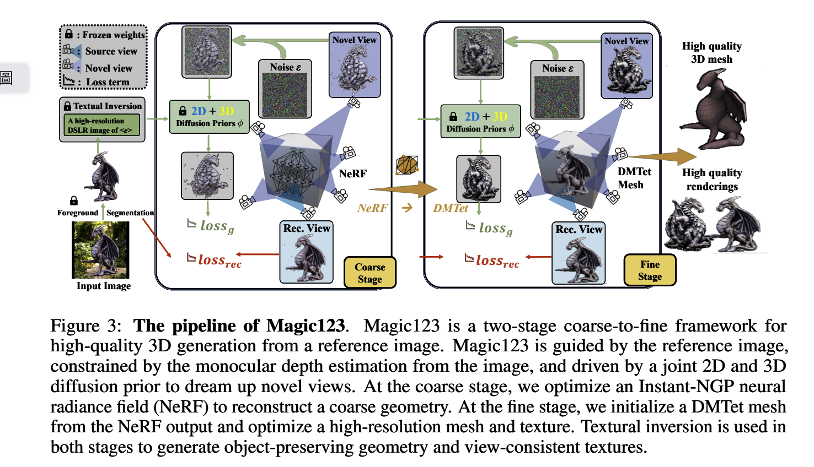

# Magic123:One Image to High-Quality 3D object Generation Using Both 2D and 3D Diffusion Priors

> https://arxiv.org/pdf/2306.17843v2.pdf

## Abstract

一種兩階段從粗到細的方法，使用 2D 和 3D 先驗從單個未擺出的圖像生成高質量、有紋理的 3D 網格

在第一階段，我們優化神經輻射場以產生粗略的幾何形狀。

在第二階段，我們採用內存高效的可微網格表示來生成具有視覺吸引力紋理的高分辨率網格。

In both stages, the 3D content is learned through reference view supervision and novel views guided by a combination of 2D and 3D diffusion priors

在這兩個階段中，3D 內容都是通過參考視圖監督和由 2D 和 3D 擴散先驗相結合引導的新穎視圖來學習的

## Introduction

相反，從計算機視覺的角度來看，儘管經過了數十年的探索和發展，從未擺出的圖像進行 3D 重建的任務（包括幾何和紋理的創建）仍然是一個未解決的不適定問題

我們將人類和機器之間 3D 重建能力的巨大差異歸因於兩個主要因素

- 大規模 3D 數據集的缺陷阻礙了 3D 幾何的大規模學習，

- 處理 3D 數據時細節水平和計算資源之間的權衡。

DreamFusion [62] 是這種基於 2D 先驗的文本到 3D 生成方法的開拓者

我們分析了 2D 和 3D 先驗的行為，發現它們都有優點和缺點。 2D 先驗對於 3D 生成表現出令人印象深刻的泛化能力，這是 3D 先驗無法實現的

然而，由於 3D 知識有限，僅依賴 2D 先驗的方法不可避免地會損害 3D 保真度和一致性。

在本文中，我們提倡同時使用這兩種先驗來指導圖像到 3D 生成中的新穎視圖，而不是僅僅依賴 2D 或 3D 先驗。

提出Magic123通過two-stage coarse-to-fine 

在coarse階段，**我們優化神經輻射場（NeRF）**

為了提升3D內容的質量，來到第二屆階段，

**採用內存高效且紋理分解的 SDF-Mesh 混合表示，稱為 Deep Marching Tetrahedra (DMTet)**

## Methodology

### Magic123 pipeline

Magic123 需要 預處理步驟區獲取外部物件，

我们利用现成的分割模型 Dense Prediction Transformer [67] 来分割对象

为了防止平面几何崩溃，即模型生成仅出现在表面上而不捕获实际几何细节的纹理，我们进一步通过预训练的 MiDaS 从参考视图中提取深度图

#### Coarse stage

> 粗阶段

Magic123 的粗略阶段旨在学习尊重参考图像的基础几何结构。 由于其以平滑、连续的方式处理复杂拓扑变化的能力很强，我们在这一阶段采用NeRF

**Instant-NGP and its optimization**

我們槓桿Instant-NGP 作為我們的NeRF推理，因為她高效推理，並且可以恢復複雜的幾何學

**Reference view reconstruction loss**

is imposed in our pipeline as one of the major loss functions to 保證薰染圖片

**Novel view guidance**

**Depth prior**

用於避免 3D 內容過於平坦或凹陷。 由於從 2D 圖像重建 3D 內容固有的模糊性，僅使用外觀重建損失可能會產生較差的幾何形狀

**Normal smoothnes**

#### Fine stage 

粗階段提供了低分辨率的3D模型，由於 NeRF 傾向於產生高頻偽影，因此可能帶有噪聲。

~~。。。。不行了，全是數學沒模型咧~~

~~好像都是一些loss的數學~~

努力！！！！

微調階段主要衝定義3D模型一家獲得更高分辨率，解開幾何和紋理。

**Textural inversion**
